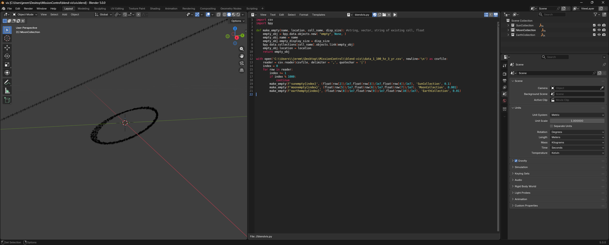

# BlendVis

This directory contains a blender file, python script, and csv of data generated during RK4-algorithm prototyping. The blender file + script allow for easy 3D visualization of the data in the csv using blender empty objects. An example is shown above. The lines to generate the csv have been left commented-out in the RK4-integrator function.

It is *highly* recommended to only graph a subset of the data points, as the script will take quite some time to process, and the resultant blender file will be extremely unwieldy otherwise.

This directory also contains an excel spreadsheet showing a quick preliminary error analysis of the orbit propagator running at different time steps over a 22-year period.
